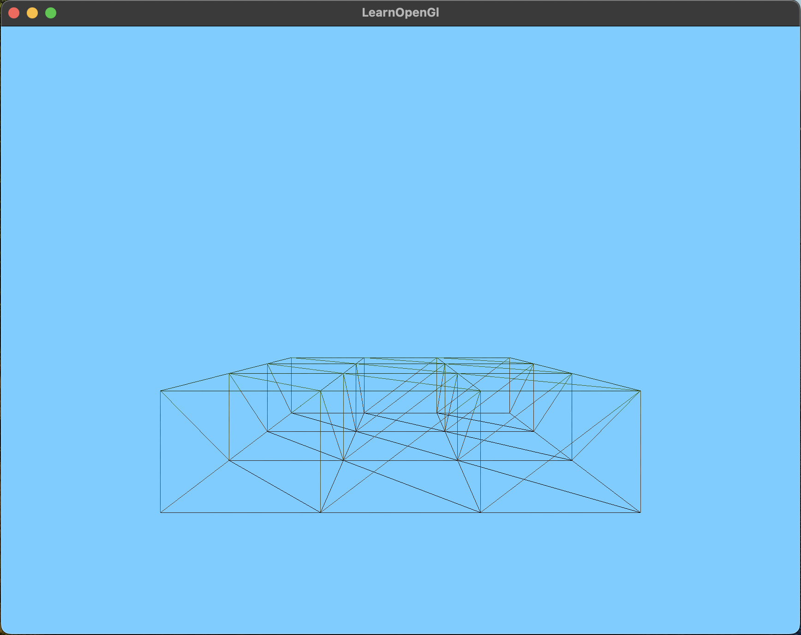

Name: Jack Fraley
Date: 10/23/24

  This application is my attempt at coding minecraft in c and c++.

10/30/31

  I have been able to render 9 full cubes in openGl. I used a texture map to allow me to render all the textures from the same file to reduce rendering speeds. As of right now my code is rendering inside faces as well as repeated vertices. This will significantly effect performance so I plan to fix this as soon as possible. I am going to use indices rather than individual vertices to prevent reused vertices from needing to be rendered. I will then run a test to see if a face that is being rendered is next to another face, and if so I will clear that face to prevent it from rendering. By using these strategies I will be able to lower the total number of rendered vertices for this layout from 324 to 89 vertices which is a 72.5% improvement in rendering time!!
  

  This image shows the render in wireframe mode which shows all the vertices that dont actually need to be rendered.
  
